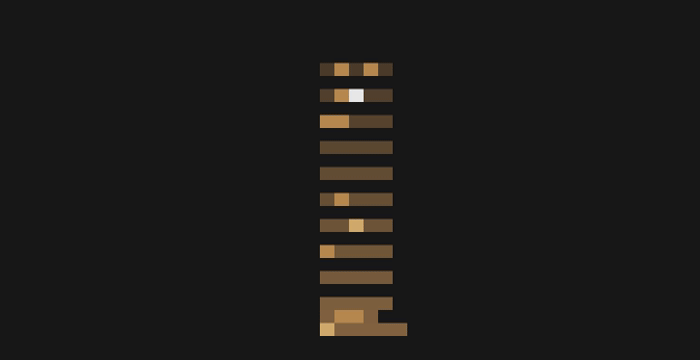
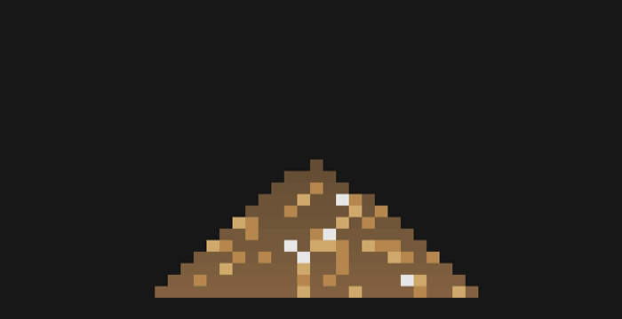
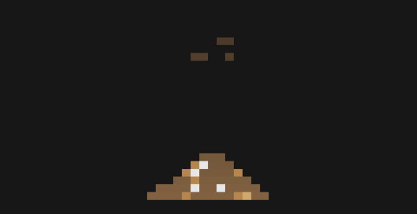
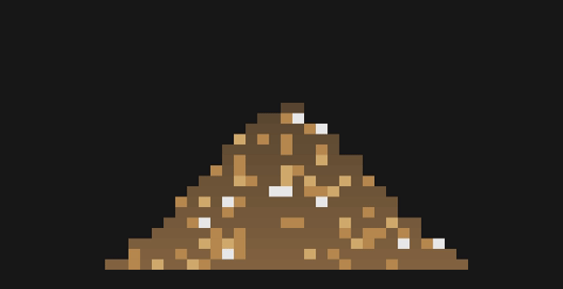

<p align="right"><a href="README.en.md">English</a> | <b>日本語</b></p>

<h1 align="center">sunayama</h1>

<p align="center"><i>ターミナルで砂遊び</i></p>

<table>
  <tr>
    <td align="center" width="50%"><br/><sub>起動時</sub></td>
    <td align="center" width="50%"><br/><sub>砂がランダムに降ってきます</sub></td>
  </tr>
  <tr>
    <td align="center" width="50%"><br/><sub><code>Space</code> で砂が降ります</sub></td>
    <td align="center" width="50%"><br/><sub>砂山が崩れます</sub></td>
  </tr>
</table>

[mugen-shell](https://github.com/tmy7533018/mugen-shell) のロック画面で作ったものを、
独立したターミナルアプリとして作り直しました。同じところから生まれた 3 つのうちのひとつです。

- [sunayama](https://github.com/tmy7533018/sunayama): ターミナルで砂遊び
- [tsukimi](https://github.com/tmy7533018/tsukimi): 月の満ち欠けと星空
- [hitodama](https://github.com/tmy7533018/hitodama): ターミナルペットの光る玉

## インストール

```sh
cargo install --git https://github.com/tmy7533018/sunayama
```

Nix:

```sh
nix run github:tmy7533018/sunayama
```

## 機能

- 砂山のアスキーアート
- タイマー機能

## 使い方

```sh
sunayama                # 通常モード
sunayama --timer <dur>  # タイマーモード (90s / 25m / 1h)
```

- 通常モードではランダムに砂が降り積ります。`Space` で砂が降ります。
- タイマーモードでは指定した時間で砂が満ちる仕様です。
- `q` / `Esc` / `Ctrl-C` で終了します。

砂の色を変えたければ `~/.config/sunayama/config` を編集してください。

## ライセンス

MIT